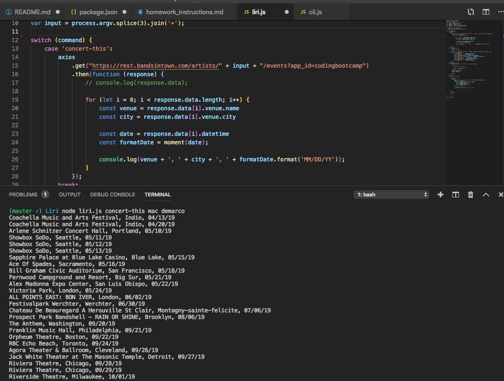
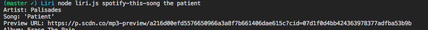
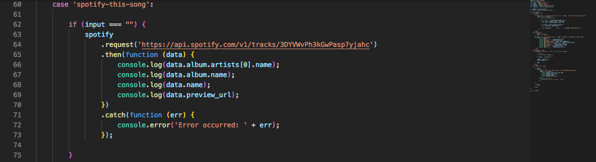
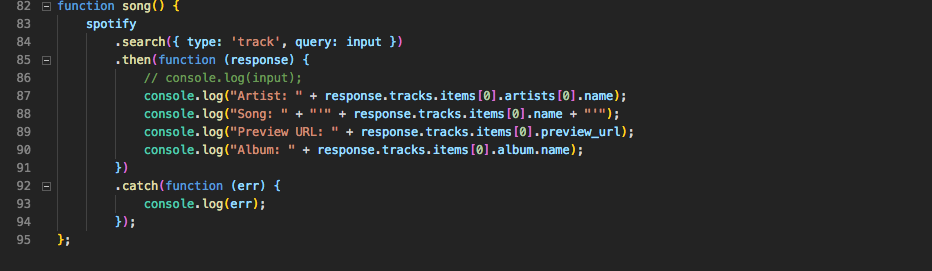
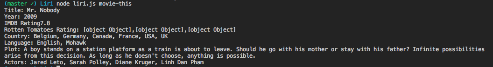
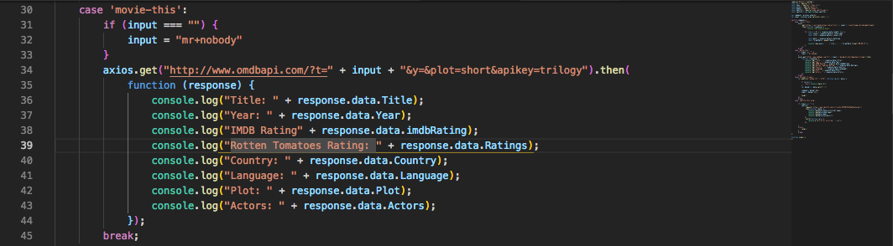
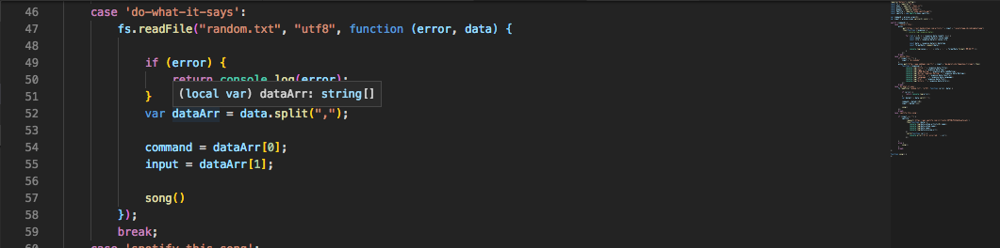

Liri is a demonstration Node JS application that allows users to search for media information from multiple sources. Users can search for songs, movies, or concerts from a terminal window. 

## Synax for utilizing Liri:
node liri.js <'search-command'> <'artist/band name here'>

## Liri accepts the following search commands:
   * `concert-this` - Search an artist's name to see concerts through the Bands in Town API
   
   

   
   
   * `spotify-this-song` - Search a song name to recieve artist and album info pertaining to that song
  
   

   If no song name accompanies the search command, there is a default

   
   

   Code:
   
   
   

   * `movie-this` - Search a movie name to recieve info on that title
    
    There is also a default if no movie title is entered
    

    Code  

    
   
   
   

   * `do-what-it-says` - The spotify search function will be called based on the song name stored in the random.txt file  

    

    Code:
    

Information on searched media is then displayed in the terminal window.

The application utilizes axios to interact with the Bands in Town api and the OMDB api to retrieve concert and movie data. When searching for songs, the application utilizes the node spotify api module to request song data. 

